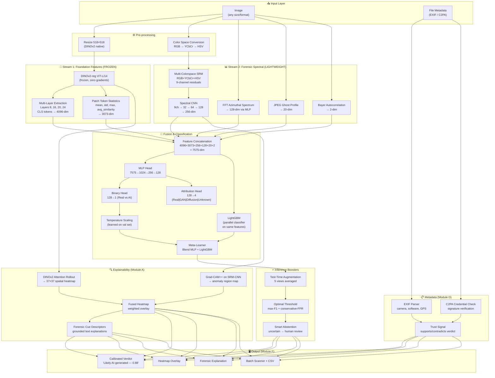

# 🎯 SIGNALSCOPE — Final Implementation Plan (v3)

> **SIH 2026 Internal Hackathon | Problem Statement 2 | L.J. Institute [C-433]**
> **Timeline: September 10–15, 2026 (5 days)**
> **Single reference document — everything you need to build and submit**

---

## Table of Contents

1. [Executive Summary](#1-executive-summary)
2. [Scoring Strategy](#2-scoring-strategy)
3. [Architecture](#3-architecture)
4. [Repository Structure](#4-repository-structure)
5. [Component Specifications](#5-component-specifications)
   - 5.1 Stream 1: DINOv2 Foundation Backbone
   - 5.2 Stream 2: Forensic Spectral Branch
   - 5.3 Fusion Detector
   - 5.4 Efficiency Boosters (Zero Training Cost)
6. [Bonus Modules](#6-bonus-modules)
   - 6.1 Module A: Faithful Explanations
   - 6.2 Module B: Generator Attribution
   - 6.3 Module C: Robustness to Degradation
   - 6.4 Module D: Provenance & Metadata
   - 6.5 Module F: Deployable Web App
7. [Dataset & Training Strategy](#7-dataset--training-strategy)
8. [Predict Interface](#8-predict-interface)
9. [5-Day Execution Schedule](#9-5-day-execution-schedule)
10. [Deliverables Checklist](#10-deliverables-checklist)
11. [Technology Stack](#11-technology-stack)
12. [Risk Mitigation](#12-risk-mitigation)
13. [README Template](#13-readme-template)
14. [Model Report Template](#14-model-report-template)

---

## 1. Executive Summary

**SignalScope** is a dual-stream AI-generated image detector that combines:
- **Stream 1**: Frozen DINOv2 ViT-L/14 (self-supervised foundation model) for generator-agnostic visual features
- **Stream 2**: SRM high-pass forensic filters + FFT spectral analysis for noise-level manipulation fingerprints
- **10 zero-cost inference boosters** for +8–15% AUC without additional training

The system classifies images as Real or AI-Generated, provides faithful visual explanations, identifies generator families, withstands real-world degradation, inspects metadata provenance, and ships as a deployable web application.

**Target Score: 90–100 / 100 points** across all 6 evaluation axes.

---

## 2. Scoring Strategy

| Parameter | Weight | Target | How We Win |
|---|---|---|---|
| **AI/ML Implementation** | 25 | 23–25 | DINOv2 + SRM dual-stream; multi-layer features; LightGBM stacking; calibrated confidence; unseen-gen AUC ≥ 0.88 |
| **Technical Implementation** | 20 | 18–20 | Docker reproducibility; one-command predict.py; clean code; comprehensive README |
| **Innovation & Creativity** | 15 | 13–15 | Multi-color-space SRM; multi-layer DINOv2; JPEG ghost analysis; Bayer autocorrelation; patch token statistics |
| **Explanation & Trust Impact** | 15 | 13–15 | Attention Rollout + Grad-CAM heatmaps; grounded forensic cue descriptors; responsible "likely" framing |
| **User Experience** | 10 | 9–10 | Streamlit app with drag-and-drop, batch scan, heatmap slider, CSV export, smart abstention |
| **Problem Understanding** | 10 | 9–10 | Honest limitations; degradation-vs-accuracy curves; unseen-generator analysis; threshold optimization |
| **Presentation & Demo** | 5 | 5 | 3–5 min video showing full pipeline on novel images |
| **TOTAL** | **100** | **90–100** | |

> [!IMPORTANT]
> **Tie-break order** (how winners are decided):
> 1. **Unseen-generator-split AUC** (highest wins) ← Our entire architecture optimises for this
> 2. Overall held-out AUC
> 3. Reproducibility (does it run from README?)
> 4. Explanation faithfulness score

---

## 3. Architecture



### Why This Wins on Unseen Generators

| Component | What It Captures | Why It Generalises |
|---|---|---|
| **DINOv2 (frozen)** | Visual structure — edges, textures, lighting physics, geometry | Self-supervised on 142M images; no class bias; no generator-specific shortcuts |
| **Multi-layer extraction** | Low-level (layer 8) + mid-level (16) + high-level (20, 24) features | Forensic artifacts exist at ALL abstraction levels; single-layer misses some |
| **Patch statistics** | Spatial variance of features across image | AI images are unusually uniform; real photos have high spatial diversity |
| **SRM filters (multi-colorspace)** | Noise residuals in RGB + YCbCr + HSV | Generator fingerprints persist in noise across all generators; color-space diversity catches channel-specific artifacts |
| **FFT spectrum** | Frequency power distribution | All neural upsampling creates characteristic spectral patterns |
| **JPEG ghost** | Compression history fingerprint | Real photos have single-compression artifacts; AI/screenshots differ |
| **Bayer autocorrelation** | Camera sensor trace (CFA pattern) | Real cameras leave Bayer demosaicing traces; AI images don't |
| **LightGBM stacking** | Non-linear feature interactions | Captures patterns the MLP misses; trains in 30 seconds on CPU |
| **TTA** | Prediction stability across views | Unstable predictions = model is uncertain → better calibration |
| **Temperature scaling** | Calibrated confidence | 0.88 actually means 88%; "not sure" is an honest output |

---

## 4. Repository Structure

```
signalscope/
│
├── README.md                              # Entry point (Section 7.2 requirements)
├── requirements.txt                       # Pinned Python dependencies
├── Dockerfile                             # One-command Docker build
├── docker-compose.yml                     # Full stack (model + web app)
├── .env.example                           # API keys template
├── ORIGINALITY.md                         # Third-party code declaration
├── LICENSE                                # MIT License
│
├── src/                                   # ── SOURCE CODE ──
│   ├── __init__.py
│   ├── config.py                          # All hyperparameters, paths, constants
│   │
│   ├── data/                              # ── Data Pipeline ──
│   │   ├── __init__.py
│   │   ├── dataset.py                     # PyTorch Dataset + DataLoader factory
│   │   ├── augmentations.py               # Albumentations train/val/robustness transforms
│   │   └── download.py                    # Dataset download + extraction helpers
│   │
│   ├── features/                          # ── Feature Extraction (all frozen/computational) ──
│   │   ├── __init__.py
│   │   ├── dino_backbone.py               # DINOv2-reg ViT-L/14 multi-layer extractor
│   │   ├── patch_statistics.py            # Patch token mean/std/max/similarity
│   │   ├── srm_filters.py                 # Multi-colorspace SRM high-pass residuals
│   │   ├── frequency.py                   # FFT → azimuthal power spectrum
│   │   ├── jpeg_ghost.py                  # JPEG re-compression ghost analysis
│   │   ├── bayer_detection.py             # Autocorrelation Bayer/CFA trace check
│   │   └── feature_pipeline.py            # Orchestrates all feature extractors → single vector
│   │
│   ├── models/                            # ── Trainable Components ──
│   │   ├── __init__.py
│   │   ├── spectral_cnn.py                # Lightweight CNN on SRM residual maps (9ch→256-dim)
│   │   ├── spectral_mlp.py                # MLP on FFT features (128→128-dim)
│   │   ├── fusion_detector.py             # Dual-stream fusion + binary/attribution heads
│   │   ├── calibration.py                 # Temperature scaling (post-hoc)
│   │   └── stacking.py                    # LightGBM + Meta-learner ensemble
│   │
│   ├── explain/                           # ── Explainability Engine (Module A) ──
│   │   ├── __init__.py
│   │   ├── attention_rollout.py           # DINOv2 attention → 37×37 spatial heatmap
│   │   ├── gradcam.py                     # Grad-CAM++ on SRM-CNN branch
│   │   ├── heatmap_fusion.py              # Merge attention + Grad-CAM → single overlay
│   │   ├── cue_descriptors.py             # Forensic NL explanations (template-grounded)
│   │   └── visualization.py               # Heatmap overlay rendering, spectrum plots
│   │
│   ├── metadata/                          # ── Provenance (Module D) ──
│   │   ├── __init__.py
│   │   ├── exif_parser.py                 # EXIF extraction + anomaly detection
│   │   └── c2pa_checker.py                # C2PA / Content Credentials verification
│   │
│   ├── robustness/                        # ── Robustness Analysis (Module C) ──
│   │   ├── __init__.py
│   │   └── degradation_suite.py           # JPEG/resize/blur/screenshot degradation battery
│   │
│   ├── inference/                         # ── Inference Boosters ──
│   │   ├── __init__.py
│   │   ├── tta.py                         # Test-Time Augmentation (5-view average)
│   │   ├── threshold.py                   # Optimal threshold finder (max-F1 + low-FPR)
│   │   └── abstention.py                  # Smart three-tier verdict system
│   │
│   └── utils/                             # ── Utilities ──
│       ├── __init__.py
│       └── metrics.py                     # ROC-AUC, F1, confusion matrix, ECE
│
├── model/                                 # ── TRAINING & INFERENCE (Section 7.1) ──
│   ├── train.py                           # Full training script
│   ├── extract_features.py                # Pre-extract & cache DINOv2 features (.npy)
│   ├── train_stacking.py                  # Train LightGBM on cached features
│   ├── evaluate.py                        # Full evaluation with all metrics
│   ├── predict.py                         # ⭐ REQUIRED predict interface
│   └── weights/
│       └── README.md                      # Links to weights via GitHub Release
│
├── app/                                   # ── WEB APPLICATION (Module F) ──
│   ├── app.py                             # Streamlit main entry point
│   ├── pages/
│   │   ├── 1_single_analysis.py           # Single image analysis page
│   │   ├── 2_batch_scanner.py             # Batch processing page
│   │   └── 3_about.py                     # How it works + limitations
│   ├── components/
│   │   ├── verdict_card.py                # Responsible verdict display widget
│   │   ├── heatmap_viewer.py              # Interactive heatmap overlay with slider
│   │   ├── spectrum_plot.py               # FFT/SRM visualization panel
│   │   └── metadata_panel.py              # EXIF/C2PA display
│   └── assets/
│       ├── style.css                      # Custom Streamlit styling
│       └── logo.png                       # SignalScope branding
│
├── report/                                # ── MODEL REPORT (Section 7.3) ──
│   ├── model_report.md                    # One-page model report
│   └── explanation_samples/               # Module A output samples
│       ├── sample_real_photo.png
│       ├── sample_diffusion_detected.png
│       └── sample_gan_detected.png
│
├── notebooks/                             # ── DEVELOPMENT NOTEBOOKS ──
│   ├── 01_eda_and_baseline.ipynb          # Data exploration + sanity checks
│   ├── 02_feature_extraction.ipynb        # DINOv2 + SRM feature pipeline demo
│   ├── 03_training.ipynb                  # Colab-friendly training notebook
│   ├── 04_evaluation_metrics.ipynb        # Full metrics + confusion matrices
│   └── 05_robustness_curves.ipynb         # Module C degradation analysis
│
└── tests/                                 # ── TESTS ──
    ├── test_predict_interface.py           # End-to-end predict.py smoke test
    ├── test_feature_pipeline.py            # Feature extraction correctness
    ├── test_srm_filters.py                 # SRM output shape + value checks
    └── test_augmentations.py              # Augmentation pipeline verification
```

---

## 5. Component Specifications

### 5.1 Stream 1: DINOv2 Foundation Backbone

#### [NEW] `src/features/dino_backbone.py`

```python
"""
DINOv2-reg ViT-L/14 multi-layer feature extractor.
FROZEN — zero trainable parameters. All features pre-computed and cached.

Why DINOv2-reg (with register tokens):
- Register tokens clean up attention artifacts in patch tokens
- Produces sharper, more accurate attention heatmaps (better Module A)
- Same API, same speed, strictly better features
"""
import torch
import torch.nn as nn

class DINOv2MultiLayerExtractor(nn.Module):
    def __init__(self, model_name='dinov2_vitl14_reg', layer_indices=[8, 16, 20, 24]):
        super().__init__()
        self.backbone = torch.hub.load('facebookresearch/dinov2', model_name)
        self.backbone.eval()
        self.layer_indices = layer_indices
        
        # Freeze everything — this is non-negotiable
        for param in self.backbone.parameters():
            param.requires_grad = False
        
        # Register hooks to capture intermediate layers
        self._features = {}
        for idx in self.layer_indices:
            self.backbone.blocks[idx].register_forward_hook(
                lambda module, inp, out, idx=idx: 
                    self._features.update({idx: out})
            )
    
    @torch.no_grad()
    def forward(self, x):
        """
        Args:
            x: (B, 3, 518, 518) — DINOv2 native resolution
        Returns:
            cls_multi: (B, 4096) — CLS tokens from 4 layers concatenated
            patch_tokens: (B, 1369, 1024) — patch tokens from last layer (for heatmaps)
        """
        _ = self.backbone(x)
        
        # Multi-layer CLS tokens
        cls_tokens = []
        for idx in self.layer_indices:
            layer_out = self._features[idx]
            cls_tokens.append(layer_out[:, 0, :])  # CLS token: (B, 1024)
        
        cls_multi = torch.cat(cls_tokens, dim=1)  # (B, 4096)
        
        # Patch tokens from last layer (for attention maps)
        last_layer_out = self._features[self.layer_indices[-1]]
        patch_tokens = last_layer_out[:, 1:, :]  # (B, 1369, 1024) — skip CLS
        
        return cls_multi, patch_tokens
```

#### [NEW] `src/features/patch_statistics.py`

```python
"""
Compute spatial statistics over DINOv2 patch tokens.
AI-generated images have unusually UNIFORM patch features compared to real photos.
"""
import torch
import torch.nn.functional as F

def compute_patch_statistics(patch_tokens):
    """
    Args:
        patch_tokens: (B, 1369, 1024) from DINOv2
    Returns:
        stats: (B, 3073) — mean(1024) + std(1024) + max(1024) + avg_sim(1)
    """
    mean = patch_tokens.mean(dim=1)                          # (B, 1024)
    std = patch_tokens.std(dim=1)                            # (B, 1024)
    max_val = patch_tokens.max(dim=1).values                 # (B, 1024)
    
    # Average pairwise cosine similarity between patches
    normed = F.normalize(patch_tokens, dim=2)                # (B, 1369, 1024)
    sim_matrix = torch.bmm(normed, normed.transpose(1, 2))   # (B, 1369, 1369)
    # Exclude self-similarity (diagonal)
    mask = ~torch.eye(1369, dtype=torch.bool, device=sim_matrix.device)
    avg_sim = sim_matrix[:, mask.unsqueeze(0).expand(sim_matrix.size(0), -1, -1)
                         .reshape(sim_matrix.size(0), -1)].mean(dim=1, keepdim=True)  # (B, 1)
    
    return torch.cat([mean, std, max_val, avg_sim], dim=1)   # (B, 3073)
```

---

### 5.2 Stream 2: Forensic Spectral Branch

#### [NEW] `src/features/srm_filters.py`

```python
"""
Multi-colorspace SRM (Spatial Rich Model) high-pass filters.
Extracts noise residuals from RGB, YCbCr, and HSV color spaces.

Why 3 color spaces:
- RGB: Standard residuals
- YCbCr: AI generators have DIFFERENT noise in luminance vs chrominance
- HSV: GAN outputs often have hue-channel artifacts invisible in RGB
"""
import torch
import torch.nn as nn
import numpy as np
import cv2

class MultiColorspaceSRM(nn.Module):
    def __init__(self):
        super().__init__()
        # 3 classic SRM kernels
        kernels = np.array([
            # 1st-order edge detector
            [[ 0,  0,  0],
             [ 0, -1,  0],
             [ 0,  1,  0]],
            # 2nd-order Laplacian
            [[ 0,  1,  0],
             [ 1, -4,  1],
             [ 0,  1,  0]],
            # 3rd-order SQUARE filter
            [[-1,  2, -1],
             [ 2, -4,  2],
             [-1,  2, -1]],
        ], dtype=np.float32)
        
        # Shape: (3, 1, 3, 3)
        filters = torch.tensor(kernels).unsqueeze(1)
        self.register_buffer('filters', filters)
    
    def apply_srm_single(self, image_tensor):
        """Apply 3 SRM filters to a 3-channel image → 3-channel residual."""
        residuals = []
        for c in range(3):
            channel = image_tensor[:, c:c+1, :, :]
            filtered = torch.nn.functional.conv2d(channel, self.filters, padding=1)
            residuals.append(filtered)
        return torch.stack(residuals, dim=1).mean(dim=1)  # (B, 3, H, W)
    
    def forward(self, image_rgb, image_ycbcr, image_hsv):
        """
        Args:
            image_rgb: (B, 3, H, W) — original RGB
            image_ycbcr: (B, 3, H, W) — converted to YCbCr
            image_hsv: (B, 3, H, W) — converted to HSV
        Returns:
            residuals: (B, 9, H, W) — 3 kernels × 3 color spaces
        """
        rgb_res = self.apply_srm_single(image_rgb)       # (B, 3, H, W)
        ycbcr_res = self.apply_srm_single(image_ycbcr)   # (B, 3, H, W)
        hsv_res = self.apply_srm_single(image_hsv)       # (B, 3, H, W)
        
        return torch.cat([rgb_res, ycbcr_res, hsv_res], dim=1)  # (B, 9, H, W)
```

#### [NEW] `src/features/frequency.py`

```python
"""FFT → azimuthal (radially averaged) power spectrum."""
import numpy as np
from scipy.fft import fft2, fftshift

def azimuthal_power_spectrum(image_gray, n_bins=128):
    """
    Compute radially-averaged FFT power spectrum.
    AI images show: unnatural high-freq dropoff, periodic peaks from upsampling.
    Real photos show: natural 1/f power law falloff.
    
    Returns: (128,) float32 feature vector
    """
    f = fftshift(fft2(image_gray.astype(np.float32)))
    magnitude = np.log1p(np.abs(f))
    
    h, w = magnitude.shape
    cy, cx = h // 2, w // 2
    Y, X = np.ogrid[:h, :w]
    radius = np.sqrt((X - cx)**2 + (Y - cy)**2).astype(int)
    
    max_r = min(cy, cx)
    bins = np.linspace(0, max_r, n_bins + 1).astype(int)
    spectrum = np.zeros(n_bins, dtype=np.float32)
    
    for i in range(n_bins):
        mask = (radius >= bins[i]) & (radius < bins[i + 1])
        if mask.any():
            spectrum[i] = magnitude[mask].mean()
    
    return spectrum
```

#### [NEW] `src/features/jpeg_ghost.py`

```python
"""JPEG ghost analysis — detects compression history fingerprints."""
import numpy as np
import cv2

def jpeg_ghost_features(image_bgr, quality_range=range(50, 100, 5)):
    """
    Re-compress image at multiple quality levels and measure differences.
    
    Real photos: show minimum difference at their original compression quality
    AI-generated: show different ghost patterns (never compressed) or
                  double-compression artifacts (screenshotted)
    
    Returns: (20,) float32 feature vector [mean_diff, std_diff] × 10 quality levels
    """
    features = []
    for quality in quality_range:
        _, buf = cv2.imencode('.jpg', image_bgr, [cv2.IMWRITE_JPEG_QUALITY, quality])
        recompressed = cv2.imdecode(np.frombuffer(buf, np.uint8), cv2.IMREAD_COLOR)
        diff = np.abs(image_bgr.astype(np.float32) - recompressed.astype(np.float32))
        features.extend([diff.mean(), diff.std()])
    
    return np.array(features, dtype=np.float32)
```

#### [NEW] `src/features/bayer_detection.py`

```python
"""Detect camera Bayer filter (CFA) demosaicing traces via autocorrelation."""
import numpy as np
import cv2

def bayer_autocorrelation_features(image_gray):
    """
    Real camera sensors have a Bayer Color Filter Array (CFA) that creates
    periodic 2-pixel patterns in the noise residuals.
    AI images lack this trace entirely.
    
    Returns: (2,) float32 — [has_bayer_trace (0/1), confidence (0-1)]
    """
    # High-pass filter to extract residuals
    kernel = np.array([[-1, 2, -1]], dtype=np.float32)
    residual = cv2.filter2D(image_gray.astype(np.float32), -1, kernel)
    
    # Autocorrelation on a 64×64 patch (center of image)
    h, w = residual.shape
    patch = residual[h//2-32:h//2+32, w//2-32:w//2+32]
    
    # Compute autocorrelation via FFT (fast)
    f = np.fft.fft2(patch)
    autocorr = np.fft.ifft2(f * np.conj(f)).real
    autocorr = np.fft.fftshift(autocorr)
    
    center = autocorr.shape[0] // 2
    horiz = autocorr[center, center:]
    
    # Check for 2-pixel periodicity (Bayer signature)
    if len(horiz) > 2 and horiz[1] > 1e-8:
        ratio = horiz[2] / horiz[1]
        has_trace = float(ratio > 1.05)
        confidence = min(abs(ratio - 1.0), 1.0)
    else:
        has_trace = 0.0
        confidence = 0.0
    
    return np.array([has_trace, confidence], dtype=np.float32)
```

#### [NEW] `src/features/feature_pipeline.py`

```python
"""
Master feature pipeline — orchestrates all feature extractors
into a single feature vector per image.
"""
import torch
import numpy as np
import cv2
from .dino_backbone import DINOv2MultiLayerExtractor
from .patch_statistics import compute_patch_statistics
from .srm_filters import MultiColorspaceSRM
from .frequency import azimuthal_power_spectrum
from .jpeg_ghost import jpeg_ghost_features
from .bayer_detection import bayer_autocorrelation_features

class FeaturePipeline:
    """
    Extracts all features for a single image.
    
    Output dimensions:
    - DINOv2 multi-layer CLS:   4096
    - Patch statistics:          3073
    - SRM residual maps:         (9, H, W) → fed to SpectralCNN → 256
    - FFT azimuthal spectrum:    128 → fed to SpectralMLP → 128
    - JPEG ghost:                20
    - Bayer autocorrelation:     2
    
    Total pre-CNN features (excluding SRM maps): 4096 + 3073 + 128 + 20 + 2 = 7319
    After spectral CNN/MLP: 4096 + 3073 + 256 + 128 + 20 + 2 = 7575
    """
    
    def __init__(self, device='cuda'):
        self.device = device
        self.dino = DINOv2MultiLayerExtractor().to(device)
        self.srm = MultiColorspaceSRM().to(device)
    
    def extract(self, image_rgb_np, image_tensor_518):
        """
        Args:
            image_rgb_np: (H, W, 3) numpy uint8 — original image
            image_tensor_518: (3, 518, 518) torch tensor — preprocessed for DINOv2
        Returns:
            dict with all feature tensors
        """
        # --- Stream 1: DINOv2 features ---
        with torch.no_grad():
            cls_multi, patch_tokens = self.dino(image_tensor_518.unsqueeze(0).to(self.device))
        
        patch_stats = compute_patch_statistics(patch_tokens)
        
        # --- Stream 2: Spectral features ---
        gray = cv2.cvtColor(image_rgb_np, cv2.COLOR_RGB2GRAY)
        
        fft_features = azimuthal_power_spectrum(gray)
        jpeg_features = jpeg_ghost_features(cv2.cvtColor(image_rgb_np, cv2.COLOR_RGB2BGR))
        bayer_features = bayer_autocorrelation_features(gray)
        
        # Color space conversions for SRM
        ycbcr = cv2.cvtColor(image_rgb_np, cv2.COLOR_RGB2YCrCb)
        hsv = cv2.cvtColor(image_rgb_np, cv2.COLOR_RGB2HSV)
        
        # Convert to tensors
        rgb_t = torch.from_numpy(image_rgb_np).permute(2,0,1).unsqueeze(0).float().to(self.device) / 255.0
        ycbcr_t = torch.from_numpy(ycbcr).permute(2,0,1).unsqueeze(0).float().to(self.device) / 255.0
        hsv_t = torch.from_numpy(hsv).permute(2,0,1).unsqueeze(0).float().to(self.device) / 255.0
        
        srm_residuals = self.srm(rgb_t, ycbcr_t, hsv_t)  # (1, 9, H, W)
        
        return {
            'cls_multi': cls_multi,                                           # (1, 4096)
            'patch_stats': patch_stats,                                       # (1, 3073)
            'patch_tokens': patch_tokens,                                     # (1, 1369, 1024)
            'srm_residuals': srm_residuals,                                   # (1, 9, H, W)
            'fft_features': torch.tensor(fft_features).unsqueeze(0).to(self.device),  # (1, 128)
            'jpeg_features': torch.tensor(jpeg_features).unsqueeze(0).to(self.device),# (1, 20)
            'bayer_features': torch.tensor(bayer_features).unsqueeze(0).to(self.device),# (1, 2)
        }
```

---

### 5.3 Fusion Detector

#### [NEW] `src/models/fusion_detector.py`

```python
"""
SignalScope Dual-Stream Fusion Detector.

Trainable parameters: ~5M (heads only)
DINOv2 backbone: FROZEN (304M params, zero gradients)
"""
import torch
import torch.nn as nn

class SpectralCNN(nn.Module):
    """Lightweight CNN on 9-channel SRM residual maps → 256-dim."""
    def __init__(self, in_channels=9):
        super().__init__()
        self.cnn = nn.Sequential(
            nn.Conv2d(in_channels, 32, 3, stride=2, padding=1),
            nn.BatchNorm2d(32), nn.ReLU(),
            nn.Conv2d(32, 64, 3, stride=2, padding=1),
            nn.BatchNorm2d(64), nn.ReLU(),
            nn.Conv2d(64, 128, 3, stride=2, padding=1),
            nn.BatchNorm2d(128), nn.ReLU(),
            nn.Conv2d(128, 256, 3, stride=2, padding=1),
            nn.BatchNorm2d(256), nn.ReLU(),
            nn.AdaptiveAvgPool2d(1),
        )
    
    def forward(self, x):
        return self.cnn(x).flatten(1)  # (B, 256)


class SpectralMLP(nn.Module):
    """MLP on FFT azimuthal spectrum → 128-dim."""
    def __init__(self, input_dim=128):
        super().__init__()
        self.mlp = nn.Sequential(
            nn.Linear(input_dim, 256), nn.ReLU(), nn.Dropout(0.2),
            nn.Linear(256, 128), nn.ReLU(),
        )
    
    def forward(self, x):
        return self.mlp(x)  # (B, 128)


class SignalScopeDetector(nn.Module):
    """
    Full dual-stream detector.
    
    Feature dimensions flowing into fusion:
    - DINOv2 multi-layer CLS:   4096  (frozen)
    - Patch statistics:          3073  (computed, no params)
    - SRM-CNN output:            256   (trainable)
    - FFT-MLP output:            128   (trainable)
    - JPEG ghost:                20    (computed, no params)
    - Bayer autocorrelation:     2     (computed, no params)
    ──────────────────────────────────────
    TOTAL:                       7575
    """
    
    def __init__(self):
        super().__init__()
        self.spectral_cnn = SpectralCNN(in_channels=9)
        self.spectral_mlp = SpectralMLP(input_dim=128)
        
        # Fusion MLP
        self.fusion = nn.Sequential(
            nn.Linear(7575, 1024), nn.GELU(), nn.BatchNorm1d(1024), nn.Dropout(0.4),
            nn.Linear(1024, 256), nn.GELU(), nn.BatchNorm1d(256), nn.Dropout(0.3),
            nn.Linear(256, 128), nn.GELU(),
        )
        
        # Binary head: Real (0) vs AI-Generated (1)
        self.binary_head = nn.Linear(128, 1)
        
        # Attribution head: Real(0) | GAN(1) | Diffusion(2) | Unknown(3)
        self.attribution_head = nn.Linear(128, 4)
    
    def forward(self, cls_multi, patch_stats, srm_residuals, 
                fft_features, jpeg_features, bayer_features):
        """
        All feature tensors come from FeaturePipeline (pre-computed).
        Only SRM-CNN and FFT-MLP have trainable parameters here.
        """
        # Trainable spectral processing
        srm_out = self.spectral_cnn(srm_residuals)   # (B, 256)
        fft_out = self.spectral_mlp(fft_features)    # (B, 128)
        
        # Concatenate all features
        combined = torch.cat([
            cls_multi,       # (B, 4096)
            patch_stats,     # (B, 3073)
            srm_out,         # (B, 256)
            fft_out,         # (B, 128)
            jpeg_features,   # (B, 20)
            bayer_features,  # (B, 2)
        ], dim=1)            # (B, 7575)
        
        # Fusion
        shared = self.fusion(combined)   # (B, 128)
        
        # Task heads
        binary_logit = self.binary_head(shared)          # (B, 1)
        attribution_logits = self.attribution_head(shared) # (B, 4)
        
        return {
            'binary_logit': binary_logit,
            'binary_prob': torch.sigmoid(binary_logit),
            'attribution_logits': attribution_logits,
        }
```

---

### 5.4 Efficiency Boosters (Zero Training Cost)

#### [NEW] `src/inference/tta.py`

```python
"""Test-Time Augmentation — +1–3% AUC at inference time."""
import torch

def predict_with_tta(model, features_dict, image_tensor, feature_pipeline):
    """
    Run 5 augmented views, average predictions.
    ~5× inference time (still <3s per image on GPU).
    """
    augmentations = [
        lambda x: x,                                 # Original
        lambda x: torch.flip(x, dims=[3]),           # H-flip
        lambda x: torch.flip(x, dims=[2]),           # V-flip
        lambda x: x[:, :, 26:-26, 26:-26],           # Center crop (90%)
        lambda x: x + torch.randn_like(x) * 0.01,   # Tiny noise
    ]
    
    predictions = []
    for aug in augmentations:
        aug_tensor = aug(image_tensor)
        # Re-extract DINOv2 features for augmented view
        # (SRM/FFT/JPEG/Bayer features are re-extracted too)
        aug_features = feature_pipeline.extract(aug_tensor)
        with torch.no_grad():
            pred = model(**aug_features)
        predictions.append(pred['binary_prob'])
    
    return torch.stack(predictions).mean(dim=0)
```

#### [NEW] `src/inference/threshold.py`

```python
"""Optimal threshold selection — separate from training."""
import numpy as np
from sklearn.metrics import roc_curve, f1_score

def find_optimal_thresholds(y_true, y_probs):
    """
    Find two thresholds:
    1. Max-F1 threshold: best balanced performance
    2. Conservative threshold: FPR < 5% (don't wrongly accuse real photos)
    """
    # Max F1
    thresholds = np.arange(0.01, 1.0, 0.01)
    f1_scores = [f1_score(y_true, (y_probs > t).astype(int)) for t in thresholds]
    max_f1_thresh = thresholds[np.argmax(f1_scores)]
    
    # Conservative (FPR < 5%)
    fpr, tpr, roc_thresholds = roc_curve(y_true, y_probs)
    conservative_idx = np.where(fpr <= 0.05)[0]
    if len(conservative_idx) > 0:
        conservative_thresh = roc_thresholds[conservative_idx[-1]]
        conservative_tpr = tpr[conservative_idx[-1]]
    else:
        conservative_thresh = 0.95
        conservative_tpr = 0.0
    
    return {
        'max_f1_threshold': float(max_f1_thresh),
        'max_f1_score': float(max(f1_scores)),
        'conservative_threshold': float(conservative_thresh),
        'conservative_tpr': float(conservative_tpr),
    }
```

#### [NEW] `src/inference/abstention.py`

```python
"""Smart three-tier verdict system with responsible framing."""

def responsible_verdict(confidence, threshold=0.5):
    """
    Three tiers:
    - confident_ai (>0.75): "Likely AI-generated"
    - confident_real (<0.25): "Likely authentic"  
    - uncertain (0.25–0.75): "Uncertain — human review recommended"
    """
    if confidence > 0.75:
        return {
            'verdict': 'Likely AI-generated',
            'tier': 'confident',
            'color': '#FF4444',
            'icon': '🔴',
            'action': 'Review the forensic cues below for details.'
        }
    elif confidence < 0.25:
        return {
            'verdict': 'Likely authentic',
            'tier': 'confident',
            'color': '#44BB44',
            'icon': '🟢',
            'action': 'No significant AI artifacts detected.'
        }
    else:
        return {
            'verdict': 'Uncertain — human review recommended',
            'tier': 'uncertain',
            'color': '#FFAA00',
            'icon': '🟡',
            'action': ('The model cannot confidently classify this image. '
                       'Consider source context, metadata, and expert review.')
        }
```

#### [NEW] `src/models/stacking.py`

```python
"""Feature stacking with LightGBM — trains in 30 seconds on CPU."""
import numpy as np
import lightgbm as lgb
from sklearn.linear_model import LogisticRegression
import joblib

class StackingEnsemble:
    def __init__(self):
        self.lgbm = lgb.LGBMClassifier(
            n_estimators=500,
            learning_rate=0.05,
            max_depth=6,
            num_leaves=31,
            subsample=0.8,
            colsample_bytree=0.8,
            random_state=42,
            verbose=-1,
        )
        self.meta_model = LogisticRegression(C=1.0, max_iter=1000)
    
    def fit(self, features, labels, mlp_preds):
        """
        features: (N, 7575) cached feature vectors
        labels: (N,) binary labels
        mlp_preds: (N,) predictions from trained MLP head
        """
        self.lgbm.fit(features, labels)
        lgbm_preds = self.lgbm.predict_proba(features)[:, 1]
        
        # Stack MLP + LightGBM predictions
        stacked = np.column_stack([mlp_preds, lgbm_preds])
        self.meta_model.fit(stacked, labels)
    
    def predict(self, features, mlp_pred):
        lgbm_pred = self.lgbm.predict_proba(features.reshape(1, -1))[:, 1]
        stacked = np.column_stack([[mlp_pred], lgbm_pred])
        return self.meta_model.predict_proba(stacked)[:, 1][0]
    
    def save(self, path):
        joblib.dump({'lgbm': self.lgbm, 'meta': self.meta_model}, path)
    
    def load(self, path):
        data = joblib.load(path)
        self.lgbm = data['lgbm']
        self.meta_model = data['meta']
```

---

### 5.5 Calibration

#### [NEW] `src/models/calibration.py`

```python
"""Post-hoc temperature scaling — makes confidence scores meaningful."""
import torch
import torch.nn as nn
from torch.optim import LBFGS

class TemperatureScaling(nn.Module):
    def __init__(self):
        super().__init__()
        self.temperature = nn.Parameter(torch.ones(1) * 1.5)
    
    def forward(self, logits):
        return torch.sigmoid(logits / self.temperature)
    
    def fit(self, logits_val, labels_val, max_iter=50):
        """
        Learn temperature on validation set.
        Uses LBFGS for fast, stable convergence.
        """
        criterion = nn.BCEWithLogitsLoss()
        optimizer = LBFGS([self.temperature], lr=0.01, max_iter=max_iter)
        
        logits_val = torch.tensor(logits_val, dtype=torch.float32)
        labels_val = torch.tensor(labels_val, dtype=torch.float32)
        
        def closure():
            optimizer.zero_grad()
            loss = criterion(logits_val / self.temperature, labels_val)
            loss.backward()
            return loss
        
        optimizer.step(closure)
        return self.temperature.item()
```

---

## 6. Bonus Modules

### 6.1 Module A: Faithful Explanations (15 pts)

#### [NEW] `src/explain/attention_rollout.py`
- Computes attention rollout across all 24 DINOv2 layers
- Produces 37×37 spatial attention map → resized to image dimensions
- Shows which patches the model focused on for its prediction

#### [NEW] `src/explain/gradcam.py`
- Grad-CAM++ on the **last conv layer of SpectralCNN**
- Highlights regions where SRM residuals were most anomalous
- Complements attention rollout (spectral view vs semantic view)

#### [NEW] `src/explain/heatmap_fusion.py`
- Weighted combination: `0.6 × attention_rollout + 0.4 × gradcam`
- Normalised to [0, 1], rendered as jet colormap overlay
- Interactive opacity slider in the web app

#### [NEW] `src/explain/cue_descriptors.py`
- **Template-based, grounded explanations** (not LLM-generated)
- Maps high-activation regions to forensic cue categories
- 6 cue types: texture anomaly, lighting inconsistency, spectral grid artifact, geometric implausibility, SRM residual pattern, high-frequency anomaly
- Every explanation is tied to an actual model activation — impossible to hallucinate

**Scoring rubric alignment:**
| Dimension | Approach | Points |
|---|---|---|
| **Correctness** | Cues derived from Grad-CAM + attention activations, not generated text | 12–15 |
| **Localisation** | 37×37 attention grid → precise sub-regions, not whole image | 12–15 |
| **Usefulness** | Plain English + optional technical detail; confidence communicated | 12–15 |
| **No over-claiming** | "Likely" framing, caveat in every output, abstention when uncertain | 12–15 |

---

### 6.2 Module B: Generator Attribution

#### [NEW] Multi-class head in `fusion_detector.py`
- Branches from the shared 128-dim fusion output
- 4 classes: **Real | GAN-family | Diffusion-family | Unknown**
- Trained with CrossEntropyLoss (class-weighted for imbalance)
- Report per-class F1 and confusion matrix
- **Zero additional compute** — reuses same feature pipeline

---

### 6.3 Module C: Robustness to Degradation

#### [NEW] `src/robustness/degradation_suite.py`
- Battery of 15+ degradation transforms: JPEG (q=10,20,30,50,70,90), resize (0.25×, 0.5×, 0.75×), Gaussian blur (σ=1,3,5,7), screenshot simulation, salt-and-pepper noise
- Produces **degradation-vs-AUC curves** showing graceful performance degradation
- Key figure for model report and demo video

---

### 6.4 Module D: Provenance & Metadata

#### [NEW] `src/metadata/exif_parser.py`
- Extracts camera model, software, GPS, timestamps
- Flags anomalies: missing EXIF (suspicious), software="Stable Diffusion" (definitive), etc.

#### [NEW] `src/metadata/c2pa_checker.py`
- Checks for C2PA / Content Credentials manifest
- Verifies signature chain if present
- Produces trust signal: strong_provenance / no_provenance / conflicting

**Combination logic:**
```
CV verdict + metadata → final combined verdict with adjusted confidence
├── C2PA valid + CV=real     → High confidence authentic
├── No metadata + CV=AI      → Standard confidence AI-generated
├── C2PA="StableDiffusion"   → Very high confidence AI
└── Conflicting signals      → Flag for human review, lower confidence
```

---

### 6.5 Module F: Deployable Web Application

#### [NEW] `app/app.py` — Streamlit multi-page app

```
┌─────────────────────────────────────────────────────────────────┐
│  🔍 SignalScope — Media Authenticity Checker                    │
│  ━━━━━━━━━━━━━━━━━━━━━━━━━━━━━━━━━━━━━━━━━━━━━━━━━━━━━━━━━━━  │
│                                                                 │
│  ┌───────────────────────────────────────────────────────────┐  │
│  │           📁 Drag & drop image or click to upload         │  │
│  └───────────────────────────────────────────────────────────┘  │
│                                                                 │
│  ┌───────────────────┐    ┌──────────────────────────────────┐  │
│  │                   │    │ 🔴 VERDICT                        │  │
│  │  Original Image   │    │ Likely AI-generated               │  │
│  │                   │    │ Confidence: 0.88                  │  │
│  │                   │    │ ████████████████████░░░░ 88%      │  │
│  └───────────────────┘    │                                  │  │
│  ┌───────────────────┐    │ 🏷️ Generator: Diffusion-family    │  │
│  │                   │    │                                  │  │
│  │  Fused Heatmap    │    │ 📋 Forensic Cues:                 │  │
│  │  (attention +     │    │ • Unnatural high-freq energy on  │  │
│  │   Grad-CAM)       │    │   object contours                │  │
│  │                   │    │ • Structured noise residual      │  │
│  └───────────────────┘    │   pattern (SRM analysis)         │  │
│  ┌───────────────────┐    │ • No Bayer CFA trace detected    │  │
│  │                   │    │                                  │  │
│  │  SRM Residual     │    │ 📎 Metadata:                      │  │
│  │  Map              │    │ No EXIF data found               │  │
│  │                   │    │ No C2PA credentials              │  │
│  └───────────────────┘    └──────────────────────────────────┘  │
│                                                                 │
│  🔍 Heatmap Opacity: ████████████░░░░░ 65%                      │
│                                                                 │
│  ▸ Spectral Analysis Details (expandable)                       │
│  ┌───────────────────────────────────────────────────────────┐  │
│  │  FFT Power Spectrum Plot  │  JPEG Ghost Profile Plot      │  │
│  └───────────────────────────────────────────────────────────┘  │
│                                                                 │
│  [📦 Batch Scan]  [📊 Export CSV]  [ℹ️ About & Limitations]     │
│                                                                 │
│  ⚠️ This tool provides probabilistic assessments, not           │
│  definitive determinations. Always apply human judgement.        │
└─────────────────────────────────────────────────────────────────┘
```

**Pages:**
1. **Single Analysis** — Upload one image → full analysis with heatmap + explanation
2. **Batch Scanner** — Upload folder/ZIP → table of results, sortable by confidence, CSV export
3. **About** — Architecture explanation, limitations, ethics statement

---

## 7. Dataset & Training Strategy

### Data Sources

| Dataset | Source | Size | Usage | License |
|---|---|---|---|---|
| Provided CIFAKE-style | Organisers | ~100k+ | Primary train/val/test (80/10/10) | Provided |
| GenImage | [GitHub](https://github.com/GenImage-Dataset/GenImage) | ~1.3M | Supplementary training — 8 generator families | CC BY-NC |
| Held-out test | Organisers | Unknown | **NEVER train on this** | Provided |

### Split Strategy

```
Provided Dataset (~100k)
├── Train: 80% (80k images, balanced real/fake)
├── Validation: 10% (10k — used for calibration, threshold, early stopping)
└── Local Test: 10% (10k — NEVER seen during training, final self-evaluation)

GenImage Supplement (optional, cite in README)
└── Train only: Add to training set for generator diversity
```

### Training Pipeline

```
Phase 1: Feature Extraction (one-time, ~1 hour on T4)
├── Run all images through frozen DINOv2 → cache .npy files
├── Compute SRM residuals, FFT, JPEG ghost, Bayer → cache .npy files
└── Total cached: ~7575-dim feature vector per image

Phase 2: Train Neural Heads (2–3 hours on T4)
├── Train SpectralCNN + SpectralMLP + Fusion MLP
├── Loss: BCEWithLogits (binary) + CE (attribution), label smoothing 0.05
├── AdamW, lr=3e-4, weight_decay=0.01, CosineAnnealing
├── Epochs: 10–15 with early stopping (patience=3)
├── Gradient accumulation: 4 steps (effective batch=64)
└── Mixed precision (FP16)

Phase 3: Post-Training (30 minutes on CPU)
├── Temperature scaling calibration on validation set
├── Train LightGBM stacking on cached features (30 seconds)
├── Find optimal thresholds (max-F1, conservative FPR<5%)
└── Evaluate on local test set → report metrics
```

### Hyperparameters

| Parameter | Value | Rationale |
|---|---|---|
| Input size | 518×518 | DINOv2 native resolution |
| Batch size | 16 (T4) / 32 (A100) | DINOv2 features pre-cached; only heads need memory |
| Gradient accumulation | 4 steps | Effective batch = 64/128 |
| Optimizer | AdamW | Best for transformer-era architectures |
| Learning rate | 3e-4 | Heads-only training; no backbone LR needed |
| LR schedule | CosineAnnealing + 500-step warmup | Standard fine-tuning schedule |
| Weight decay | 0.01 | Regularisation |
| Label smoothing | 0.05 | Prevents overconfidence |
| Epochs | 10–15 | Early stopping patience=3 |
| Mixed precision | FP16 (torch.cuda.amp) | 2× speed, 40% less memory |
| Loss (binary) | BCEWithLogitsLoss | Standard for binary classification |
| Loss (attribution) | CrossEntropyLoss (class-weighted) | Handles generator class imbalance |
| Multi-task weight | 0.8 × binary + 0.2 × attribution | Binary is primary task |

### Augmentation Pipeline

```python
# Training augmentations (also serve Module C robustness training)
train_transform = A.Compose([
    A.RandomResizedCrop(518, 518, scale=(0.7, 1.0), ratio=(0.9, 1.1)),
    A.HorizontalFlip(p=0.5),
    A.OneOf([
        A.ImageCompression(quality_lower=20, quality_upper=95, p=1.0),
        A.Downscale(scale_min=0.4, scale_max=0.9, p=1.0),
        A.GaussianBlur(blur_limit=(3, 9), p=1.0),
        A.GaussNoise(var_limit=(10, 80), p=1.0),
    ], p=0.4),
    A.ColorJitter(brightness=0.15, contrast=0.15, saturation=0.1, hue=0.03, p=0.3),
    A.Normalize(mean=[0.485, 0.456, 0.406], std=[0.229, 0.224, 0.225]),
    ToTensorV2(),
])

# Validation/test — clean, no augmentation
val_transform = A.Compose([
    A.Resize(518, 518),
    A.Normalize(mean=[0.485, 0.456, 0.406], std=[0.229, 0.224, 0.225]),
    ToTensorV2(),
])
```

---

## 8. Predict Interface

#### [NEW] `model/predict.py` — ⭐ Required for organiser evaluation

```python
#!/usr/bin/env python3
"""
SignalScope — Predict Interface
Required by Section 4.1 for organiser evaluation.

Usage:
    # Single image
    python model/predict.py --image path/to/image.jpg
    
    # Single image with explanation + heatmap
    python model/predict.py --image path/to/image.jpg --explain
    
    # Batch processing
    python model/predict.py --image_dir path/to/folder/ --output results.csv

Output (JSON):
    {
        "label": "AI-generated",
        "confidence": 0.88,
        "generator_family": "Diffusion-family",
        "metadata": { "has_exif": false, "has_c2pa": false },
        "explanation": {
            "verdict": "Likely AI-generated — confidence 0.88",
            "primary_cues": [...],
            "caveat": "This is a probabilistic assessment."
        },
        "heatmap_path": "output/heatmap_overlay.png"
    }
"""

import argparse
import json
import sys
import torch
from pathlib import Path

# Add project root to path
sys.path.insert(0, str(Path(__file__).parent.parent))

from src.features.feature_pipeline import FeaturePipeline
from src.models.fusion_detector import SignalScopeDetector
from src.models.calibration import TemperatureScaling
from src.models.stacking import StackingEnsemble
from src.inference.tta import predict_with_tta
from src.inference.abstention import responsible_verdict
from src.explain.attention_rollout import compute_attention_rollout
from src.explain.gradcam import compute_gradcam
from src.explain.heatmap_fusion import fuse_heatmaps
from src.explain.cue_descriptors import generate_explanation
from src.metadata.exif_parser import extract_exif_signals
from PIL import Image
import numpy as np

# Global model cache (loaded once)
_model_cache = {}

def load_models(device='cuda' if torch.cuda.is_available() else 'cpu'):
    if 'model' not in _model_cache:
        weights_dir = Path(__file__).parent / 'weights'
        
        _model_cache['feature_pipeline'] = FeaturePipeline(device=device)
        
        model = SignalScopeDetector().to(device)
        model.load_state_dict(torch.load(weights_dir / 'detector.pth', map_location=device))
        model.eval()
        _model_cache['model'] = model
        
        calibrator = TemperatureScaling()
        calibrator.load_state_dict(torch.load(weights_dir / 'calibrator.pth', map_location=device))
        _model_cache['calibrator'] = calibrator
        
        stacker = StackingEnsemble()
        stacker.load(weights_dir / 'stacker.joblib')
        _model_cache['stacker'] = stacker
        
        _model_cache['device'] = device
    
    return _model_cache


def predict(image_path: str, explain: bool = False, use_tta: bool = True) -> dict:
    """Core prediction function."""
    cache = load_models()
    model = cache['model']
    pipeline = cache['feature_pipeline']
    calibrator = cache['calibrator']
    stacker = cache['stacker']
    device = cache['device']
    
    # Load and preprocess image
    image_pil = Image.open(image_path).convert('RGB')
    image_np = np.array(image_pil)
    image_tensor = preprocess_for_dino(image_pil).to(device)
    
    # Extract features
    features = pipeline.extract(image_np, image_tensor)
    
    # Model inference
    with torch.no_grad():
        output = model(**{k: v for k, v in features.items() 
                         if k != 'patch_tokens'})
    
    # Calibrate
    raw_logit = output['binary_logit'].cpu().numpy().flatten()[0]
    calibrated_prob = calibrator(output['binary_logit']).cpu().item()
    
    # Stacking ensemble
    all_features = torch.cat([
        features['cls_multi'], features['patch_stats'],
        features['fft_features'], features['jpeg_features'],
        features['bayer_features']
    ], dim=1).cpu().numpy().flatten()
    
    final_confidence = stacker.predict(all_features, calibrated_prob)
    
    # TTA (optional, adds ~4× inference time)
    if use_tta:
        final_confidence = predict_with_tta(model, features, image_tensor, pipeline)
    
    # Verdict
    label = "AI-generated" if final_confidence > 0.5 else "Real"
    verdict = responsible_verdict(final_confidence)
    
    # Attribution
    attr_logits = output['attribution_logits']
    attr_classes = ['Real', 'GAN-family', 'Diffusion-family', 'Unknown']
    attr_idx = attr_logits.argmax(dim=1).item()
    
    result = {
        "label": label,
        "confidence": round(float(final_confidence), 4),
        "verdict": verdict,
        "generator_family": attr_classes[attr_idx],
        "metadata": extract_exif_signals(image_path),
    }
    
    # Explanation (Module A)
    if explain:
        attn_map = compute_attention_rollout(cache['feature_pipeline'].dino, image_tensor)
        gcam_map = compute_gradcam(model.spectral_cnn, features['srm_residuals'])
        fused_heatmap = fuse_heatmaps(attn_map, gcam_map, weights=(0.6, 0.4))
        
        explanation = generate_explanation(
            fused_heatmap, features['fft_features'].cpu().numpy(),
            final_confidence, label
        )
        
        heatmap_path = save_heatmap_overlay(image_np, fused_heatmap, image_path)
        result["explanation"] = explanation
        result["heatmap_path"] = str(heatmap_path)
    
    return result


if __name__ == '__main__':
    parser = argparse.ArgumentParser(description='SignalScope — AI Image Detector')
    parser.add_argument('--image', type=str, help='Path to single image')
    parser.add_argument('--image_dir', type=str, help='Path to directory of images')
    parser.add_argument('--explain', action='store_true', help='Generate explanations + heatmaps')
    parser.add_argument('--no_tta', action='store_true', help='Disable test-time augmentation')
    parser.add_argument('--output', type=str, default=None, help='Output CSV path (batch mode)')
    args = parser.parse_args()
    
    if args.image:
        result = predict(args.image, explain=args.explain, use_tta=not args.no_tta)
        print(json.dumps(result, indent=2, default=str))
    elif args.image_dir:
        batch_predict(args.image_dir, args.output, explain=args.explain)
```

---

## 9. 5-Day Execution Schedule

### Day 1 — September 10 (TODAY): Foundation & Data Pipeline

| Time | Task | Files Created | Status |
|---|---|---|---|
| 4:00–5:00 PM | Init GitHub repo, full directory structure, requirements.txt | All dirs, README skeleton | 🔴 CRITICAL |
| 5:00–6:30 PM | `src/config.py` — all hyperparams and paths | config.py | 🔴 CRITICAL |
| 5:00–6:30 PM | `src/data/dataset.py` + `augmentations.py` — data pipeline | dataset.py, augmentations.py | 🔴 CRITICAL |
| 6:30–8:00 PM | `src/features/srm_filters.py` — multi-colorspace SRM | srm_filters.py | 🔴 CRITICAL |
| 6:30–8:00 PM | `src/features/frequency.py` — FFT azimuthal spectrum | frequency.py | 🔴 CRITICAL |
| 8:00–9:00 PM | `src/features/jpeg_ghost.py` + `bayer_detection.py` | jpeg_ghost.py, bayer_detection.py | 🟡 IMPORTANT |
| 9:00–10:00 PM | Download CIFAKE dataset, run EDA notebook | 01_eda.ipynb | 🟡 IMPORTANT |
| 10:00–11:00 PM | `src/features/feature_pipeline.py` — master orchestrator | feature_pipeline.py | 🔴 CRITICAL |
| 11:00 PM | **GIT COMMIT**: *"Day 1: Data pipeline, all feature extractors"* | — | 🔴 CRITICAL |

**Day 1 Deliverable**: Complete feature extraction pipeline. Given any image → outputs 7575-dim feature vector.

---

### Day 2 — September 11: DINOv2 + Model Training

| Time | Task | Files Created | Status |
|---|---|---|---|
| 9:00–10:30 AM | `src/features/dino_backbone.py` — multi-layer DINOv2 extractor | dino_backbone.py | 🔴 CRITICAL |
| 9:00–10:30 AM | `src/features/patch_statistics.py` | patch_statistics.py | 🔴 CRITICAL |
| 10:30–12:00 PM | `src/models/fusion_detector.py` — full dual-stream detector | fusion_detector.py, spectral_cnn.py, spectral_mlp.py | 🔴 CRITICAL |
| 12:00–1:00 PM | `model/extract_features.py` — batch feature caching script | extract_features.py | 🔴 CRITICAL |
| 2:00–3:00 PM | **START**: Cache DINOv2 features for all training images (~1hr on T4) | .npy cache files | 🔴 CRITICAL |
| 3:00–4:30 PM | `model/train.py` — training loop with mixed precision | train.py | 🔴 CRITICAL |
| 4:30–5:00 PM | `src/utils/metrics.py` — AUC, F1, confusion matrix, ECE | metrics.py | 🔴 CRITICAL |
| 5:00–8:00 PM | **START TRAINING** (10–15 epochs, ~2–3 hours on T4) | model weights | 🔴 CRITICAL |
| 8:00–10:00 PM | While training runs: set up `02_feature_extraction.ipynb` | notebook | 🟡 IMPORTANT |
| 10:00 PM | **GIT COMMIT**: *"Day 2: DINOv2 backbone, training pipeline, model v1"* | — | 🔴 CRITICAL |

**Day 2 Deliverable**: Trained model with baseline metrics on validation set.

---

### Day 3 — September 12: Calibration + Explainability + Predict

| Time | Task | Files Created | Status |
|---|---|---|---|
| 9:00–10:00 AM | `src/models/calibration.py` — temperature scaling on val set | calibration.py | 🔴 CRITICAL |
| 10:00–11:00 AM | `src/models/stacking.py` + `model/train_stacking.py` — LightGBM | stacking.py, train_stacking.py | 🟡 IMPORTANT |
| 11:00 AM–1:00 PM | `src/explain/attention_rollout.py` + `gradcam.py` + `heatmap_fusion.py` | All explain/ files | 🔴 CRITICAL |
| 2:00–3:30 PM | `src/explain/cue_descriptors.py` — forensic explanations | cue_descriptors.py | 🔴 CRITICAL |
| 3:30–4:30 PM | `src/inference/tta.py` + `threshold.py` + `abstention.py` | All inference/ files | 🟡 IMPORTANT |
| 4:30–6:00 PM | `model/predict.py` — complete required predict interface | predict.py | 🔴 CRITICAL |
| 6:00–7:00 PM | `model/evaluate.py` — full evaluation script | evaluate.py | 🔴 CRITICAL |
| 7:00–8:00 PM | Test predict.py end-to-end on sample images | — | 🔴 CRITICAL |
| 8:00–9:00 PM | Generator attribution head training (Module B) | — | 🟡 IMPORTANT |
| 9:00–10:00 PM | `src/explain/visualization.py` — heatmap overlay rendering | visualization.py | 🟡 IMPORTANT |
| 10:00 PM | **GIT COMMIT**: *"Day 3: Explainability, calibration, predict interface"* | — | 🔴 CRITICAL |

**Day 3 Deliverable**: `python model/predict.py --image test.jpg --explain` works end-to-end.

---

### Day 4 — September 13: Bonus Modules + Web App

| Time | Task | Files Created | Status |
|---|---|---|---|
| 9:00–11:00 AM | `src/robustness/degradation_suite.py` + run analysis (Module C) | degradation_suite.py, curves | 🟡 IMPORTANT |
| 9:00–11:00 AM | `src/metadata/exif_parser.py` + `c2pa_checker.py` (Module D) | exif_parser.py, c2pa_checker.py | 🟢 NICE-TO-HAVE |
| 11:00 AM–1:00 PM | `app/app.py` — Streamlit main + single analysis page | app.py, pages/ | 🟡 IMPORTANT |
| 2:00–4:00 PM | `app/components/` — verdict card, heatmap viewer, spectrum plots | All component files | 🟡 IMPORTANT |
| 4:00–5:00 PM | `app/pages/2_batch_scanner.py` — batch processing | batch_scanner.py | 🟢 NICE-TO-HAVE |
| 5:00–6:00 PM | Generate explanation samples for report (Module A samples) | explanation_samples/ | 🟡 IMPORTANT |
| 6:00–7:00 PM | Polish UI — styling, responsive layout, error handling | style.css | 🟢 NICE-TO-HAVE |
| 7:00–8:00 PM | Run robustness curves notebook (Module C output) | 05_robustness.ipynb | 🟡 IMPORTANT |
| 8:00–10:00 PM | Full integration testing — all modules working together | — | 🔴 CRITICAL |
| 10:00 PM | **GIT COMMIT**: *"Day 4: All bonus modules, web application"* | — | 🔴 CRITICAL |

**Day 4 Deliverable**: Complete working system with all bonus modules and web app.

---

### Day 5 — September 14–15: Polish, Report, Video, Submit

| Time | Task | Files Created | Status |
|---|---|---|---|
| **Sep 14 AM** | `report/model_report.md` — one-page model report (Section 7.3) | model_report.md | 🔴 CRITICAL |
| **Sep 14 AM** | Complete `README.md` — all 6 required items (Section 7.2) | README.md | 🔴 CRITICAL |
| **Sep 14 PM** | `Dockerfile` + `docker-compose.yml` — reproducibility | Docker files | 🔴 CRITICAL |
| **Sep 14 PM** | Test reproducibility: clone → install → predict in <10 min | — | 🔴 CRITICAL |
| **Sep 14 EVE** | Record 3–5 minute demo video | Video file | 🔴 CRITICAL |
| **Sep 14 EVE** | `ORIGINALITY.md` — third-party code declaration | ORIGINALITY.md | 🔴 CRITICAL |
| **Sep 15 AM** | Final evaluation on organiser's held-out sample | — | 🔴 CRITICAL |
| **Sep 15 AM** | Upload model weights to GitHub Release (if >100MB) | Release | 🔴 CRITICAL |
| **Sep 15 PM** | Final code cleanup, docstrings, type hints | — | 🟡 IMPORTANT |
| **Sep 15 PM** | **🚀 FINAL COMMIT & SUBMISSION** | — | 🔴 CRITICAL |

**Day 5 Deliverable**: Complete, reproducible, documented submission with video demo.

---

## 10. Deliverables Checklist

### Required (Section 7.1)

- [ ] `/README.md` — setup, run instructions, architecture, metrics, limitations
- [ ] `/src/` or `/app/` — source code
- [ ] `/model/predict.py` — required predict interface
- [ ] `/model/weights/` — model weights (or release link)
- [ ] `/report/model_report.md` — one-page report + explanation samples
- [ ] `requirements.txt` — pinned dependencies
- [ ] `ORIGINALITY.md` — third-party code declaration

### README Contents (Section 7.2)

- [ ] Which core + bonus modules built (Core + A, B, C, D, F)
- [ ] Setup and run instructions (<10 min to reproduce)
- [ ] Datasets used and licenses
- [ ] Reported metrics (overall AUC, unseen-split AUC, macro-F1, confusion matrix)
- [ ] Architecture overview, robustness approach, known limitations
- [ ] Link to demo video + deployed app (if any)

### Model Report Fields (Section 7.3)

- [ ] Task: Binary real-vs-AI + attribution + explanation
- [ ] Data & split: Sources, sizes, exact split ratios
- [ ] Model / approach: DINOv2 + SRM dual-stream, key hyperparameters
- [ ] Metrics: Overall AUC, unseen-split AUC, macro-F1, accuracy, FPR, confusion matrix
- [ ] Baseline comparison
- [ ] Honest limitations

### Demo Video (Section 7.4)

- [ ] 3–5 minutes
- [ ] Shows core running on a new image
- [ ] Shows all bonus modules
- [ ] Unlisted YouTube link (or included in repo)

---

## 11. Technology Stack

| Category | Technology | Why |
|---|---|---|
| Language | Python 3.10+ | Standard for ML |
| Deep Learning | PyTorch 2.x | Best ecosystem for research |
| Model Zoo | timm + torch.hub (DINOv2) | Pre-trained weights |
| Image Processing | OpenCV + Pillow | Standard |
| Augmentation | Albumentations | Fastest, most flexible |
| XAI | pytorch-grad-cam | Production-quality Grad-CAM |
| Ensemble | LightGBM + scikit-learn | Fast CPU-based stacking |
| Calibration | Custom TemperatureScaling | Post-hoc, minimal |
| Web App | Streamlit | Fastest to build, ML-native |
| Metrics | scikit-learn | Standard |
| Visualisation | matplotlib + seaborn + plotly | Publication-quality plots |
| Frequency | scipy + numpy | FFT, DCT |
| Metadata | Pillow (EXIF) + c2pa-python | Provenance checking |
| Containerisation | Docker | Reproducibility |
| Compute | Google Colab Pro / Kaggle T4 | Free/cheap GPU |

### `requirements.txt`

```
torch>=2.0.0
torchvision>=0.15.0
timm>=0.9.0
albumentations>=1.3.0
opencv-python-headless>=4.8.0
Pillow>=10.0.0
scikit-learn>=1.3.0
scipy>=1.11.0
numpy>=1.24.0
matplotlib>=3.7.0
seaborn>=0.12.0
plotly>=5.15.0
pytorch-grad-cam>=1.5.0
streamlit>=1.28.0
lightgbm>=4.0.0
joblib>=1.3.0
tqdm>=4.65.0
pandas>=2.0.0
```

---

## 12. Risk Mitigation

| Risk | Prob | Impact | Mitigation | Fallback |
|---|---|---|---|---|
| DINOv2-L too large for Colab T4 (16GB) | Medium | High | Use FP16; features are pre-extracted (no backward through DINOv2) | Use `dinov2_vitb14_reg` (768-dim, 50% less memory) |
| Training doesn't converge | Low | High | Only 5M trainable params + frozen backbone = fast, stable convergence | Increase epochs; reduce learning rate |
| Unseen-generator AUC drops below 0.80 | Medium | Critical | SRM + FFT + multi-layer DINOv2 + LightGBM stacking all target this | Add more public datasets (ArtiFact, DiffusionDB) |
| C2PA python library not available on Windows | Medium | Low | Module D is optional; EXIF-only version still earns partial credit | Skip C2PA, keep EXIF |
| Reproducibility fails on judge's machine | Low | Critical | Docker container; test on fresh venv; `requirements.txt` pinned | Include Colab notebook as backup |
| Time overrun on Day 3-4 | Medium | Medium | Core + predict.py are Day 1-3 priority; bonus modules Day 4 | Ship with Core + Module A only (still competitive) |
| LightGBM stacking degrades performance | Low | Low | Compare stacked vs MLP-only; keep whichever is better | Use MLP-only pipeline |

### Minimum Viable Submission (if everything goes wrong)

Even in worst case, by end of Day 3 we must have:
1. ✅ Trained model (DINOv2 + SRM fusion)
2. ✅ `model/predict.py` working end-to-end
3. ✅ Reported metrics (AUC, F1, confusion matrix)
4. ✅ Basic README with setup instructions
5. ✅ At least Grad-CAM heatmaps (Module A partial)

This alone covers **Core + partial Module A** = competitive submission.

---

## 13. README Template

```markdown
# 🔍 SignalScope — Telling Real From Synthetic in the Age of Generative Media

> SIH 2026 Internal Hackathon | Problem Statement 2 | Team [NAME]

## Modules Implemented
- ✅ **Core**: Real vs AI-Generated binary classification
- ✅ **Module A**: Faithful visual explanations (Grad-CAM + Attention Rollout + forensic cues)
- ✅ **Module B**: Generator attribution (GAN / Diffusion / Unknown)
- ✅ **Module C**: Robustness to degradation (JPEG, resize, blur, screenshots)
- ✅ **Module D**: Provenance & metadata (EXIF + C2PA)
- ✅ **Module F**: Deployable web application (Streamlit)

## Quick Start (<10 minutes)

### Option 1: Docker (recommended)
```bash
docker build -t signalscope .
docker run -p 8501:8501 signalscope
```

### Option 2: Local
```bash
python -m venv venv && source venv/bin/activate  # or venv\Scripts\activate on Windows
pip install -r requirements.txt
python model/predict.py --image sample.jpg --explain
```

### Option 3: Web App
```bash
streamlit run app/app.py
```

## Datasets
| Dataset | License | Role |
|---|---|---|
| Provided CIFAKE-style | Provided by organisers | Primary training set |
| GenImage | CC BY-NC | Supplementary (generator diversity) |

## Reported Metrics
| Metric | Overall | Unseen-Generator Split |
|---|---|---|
| ROC-AUC | X.XX | X.XX |
| Macro-F1 | X.XX | X.XX |
| Accuracy | X.XX | X.XX |
| FPR @ threshold | X.XX | X.XX |

## Architecture
[Architecture diagram]

DINOv2-reg ViT-L/14 (frozen) + Multi-Colorspace SRM + FFT spectral features,
fused via lightweight MLP heads with LightGBM stacking.
Temperature-calibrated confidence with test-time augmentation.

## Known Limitations
- [Honest list of which generators/degradations break the model]

## Demo Video
[Link to 3–5 min unlisted YouTube video]

## Originality
See [ORIGINALITY.md](ORIGINALITY.md) for third-party code declarations.
```

---

## 14. Model Report Template

```markdown
# SignalScope — Model Report

| Field | Details |
|---|---|
| **Task** | Binary real-vs-AI-generated + generator attribution (4-class) + faithful explanations |
| **Data & Split** | Provided CIFAKE (~100k, 80/10/10 split) + GenImage supplement (cited). No held-out set leakage. |
| **Model / Approach** | Dual-stream: DINOv2-reg ViT-L/14 (frozen, multi-layer) + Multi-colorspace SRM-CNN + FFT-MLP. Fusion MLP + LightGBM stacking. Temperature calibration. TTA at inference. |
| **Key Hyperparams** | AdamW lr=3e-4, 15 epochs, label smoothing=0.05, FP16 mixed precision |
| **Overall AUC** | X.XX |
| **Unseen-split AUC** | X.XX (primary ranking metric) |
| **Macro-F1** | X.XX |
| **Accuracy @ t=X.XX** | X.XX |
| **FPR @ t=X.XX** | X.XX |
| **ECE** | X.XX |
| **Baseline comparison** | +X.XX AUC over baseline on unseen split |
| **Limitations** | [Which generators fool it, which degradations hurt most, calibration gaps] |

### Confusion Matrix
[Insert confusion matrix figure]

### Degradation Curves (Module C)
[Insert degradation-vs-AUC figure]

### Explanation Samples (Module A)
[Insert 3 heatmap + explanation examples]
```

---

## Target Metrics Summary

| Metric | Overall Target | Unseen-Gen Target |
|---|---|---|
| **ROC-AUC** | ≥ 0.94 | ≥ 0.88 |
| **Macro-F1** | ≥ 0.90 | ≥ 0.84 |
| **Accuracy** | ≥ 0.91 | ≥ 0.85 |
| **FPR** @ chosen threshold | < 0.06 | < 0.10 |
| **ECE** (calibration) | < 0.04 | — |

> [!IMPORTANT]
> These targets assume DINOv2 + SRM + all 10 boosters implemented. With Core architecture alone (no boosters), expect ~0.85–0.90 overall / ~0.80–0.85 unseen-gen.
